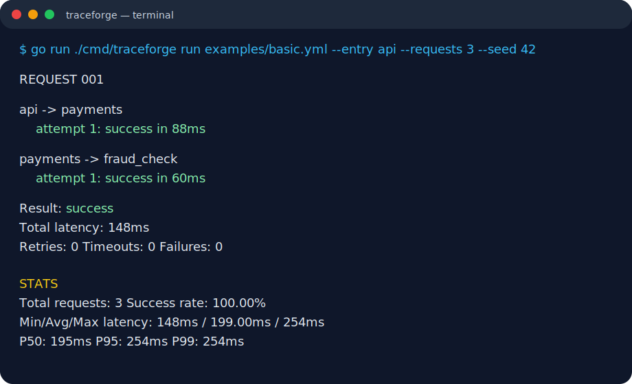
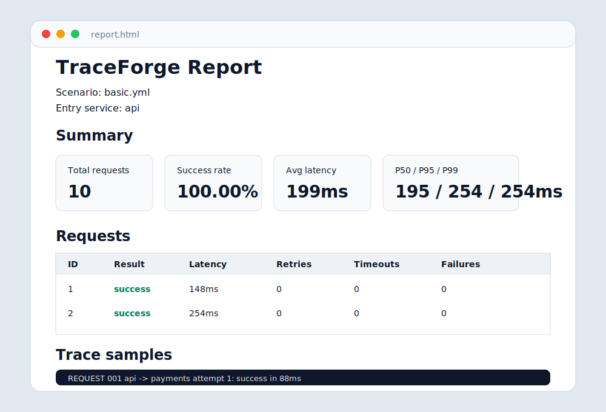

# TraceForge

TraceForge is a distributed system simulator written in Go.

It reads a YAML scenario, executes simulated service-to-service calls, and prints a textual trace with latency, failures, timeouts, retries, and batch statistics. It can also generate a static HTML report.

## Why this project exists

TraceForge is a portfolio-friendly CLI project focused on Go fundamentals that matter in backend systems:

- CLI design with Cobra.
- YAML parsing and validation.
- Deterministic simulations for testability.
- Retries, timeouts, failure rates, and latency modeling.
- Batch execution with controlled concurrency.
- Context cancellation and race-safe aggregation.
- Native Go tests and CI.
- Dockerized execution.

## Quick start

```bash
go test ./...
go run ./cmd/traceforge version
go run ./cmd/traceforge run examples/basic.yml --entry api
```

Run a batch with a deterministic seed:

```bash
go run ./cmd/traceforge run examples/concurrency.yml --entry api --requests 100 --concurrency 20 --seed 42
```

Generate HTML:

```bash
go run ./cmd/traceforge run examples/basic.yml --entry api --requests 10 --seed 42 --html report.html
```

## Docker

```bash
docker build -t traceforge .
docker run --rm -v "$PWD:/work" traceforge run examples/basic.yml --entry api
```

Or:

```bash
docker compose up --build
```

## Make commands

```bash
make test
make lint
make build
make run
make race
```

## Scenario format

```yaml
simulation:
  max_depth: 10
  default_timeout_ms: 500

services:
  api:
    calls:
      - service: payments
        timeout_ms: 200
        retry:
          attempts: 2
          backoff_ms: 50

  payments:
    failure_rate: 0.2
    latency_ms:
      min: 80
      max: 400
    calls:
      - service: fraud_check
        timeout_ms: 150

  fraud_check:
    failure_rate: 0.1
    latency_ms:
      min: 40
      max: 120
```

See [docs/scenario-format.md](docs/scenario-format.md) for full details.

## Example output

```text
REQUEST 001

api -> payments
  attempt 1: success in 120ms

payments -> fraud_check
  attempt 1: success in 88ms

Result: success
Total latency: 208ms
Retries: 0
Timeouts: 0
Failures: 0
```

For multiple requests, TraceForge prints each request followed by aggregate statistics including success rate, min/max/average latency, p50, p95, p99, total retries, and total timeouts.

## Screenshots

Terminal trace output:



Static HTML report:



## Project architecture

```text
cmd/traceforge        CLI entrypoint
internal/scenario    YAML types, parser, validation, defaults
internal/simulation  sequential and batch simulation engine
internal/stats       aggregate stats and percentiles
internal/output      text and static HTML renderers
examples             runnable scenarios
docs                 architecture and scenario docs
specs                implementation plan by phase
```

See [docs/architecture.md](docs/architecture.md) for design notes.

## Technical decisions

- No database in the MVP.
- No HTTP API in the MVP.
- No web UI in the MVP; HTML is static output only.
- Randomness is injected behind `RandomSource` so tests are deterministic.
- Seeded batch execution derives each request seed from `seed + requestNumber`, so concurrency does not change ordered results.
- Validation is intentionally strict: calls need an explicit timeout or `simulation.default_timeout_ms`.

## Known limitations

- Latency and failures are simple random models, not real network emulation.
- Cycles are only allowed when `simulation.max_depth` is configured.
- HTML report has no external assets or interactive charts.
- Text traces are optimized for readability, not machine ingestion.

## Next steps

- Export JSON.
- Export OpenTelemetry-like traces.
- Generate Mermaid graphs.
- Watch mode.
- Compare two scenarios.
- Circuit breaker, bulkhead, rate-limit, and queue simulations.
- GitHub Releases for binaries.
